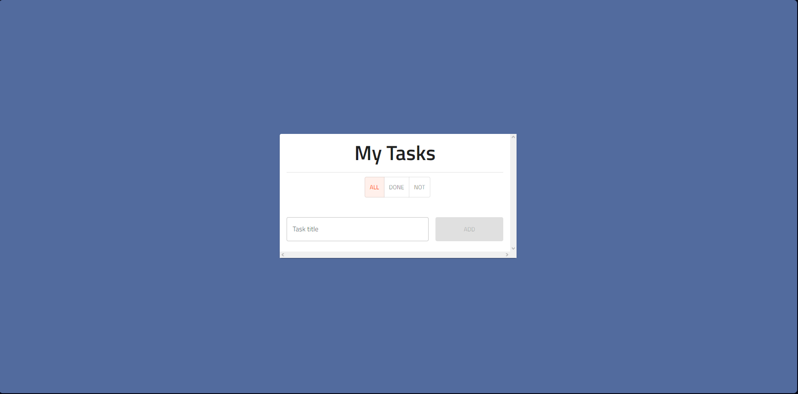
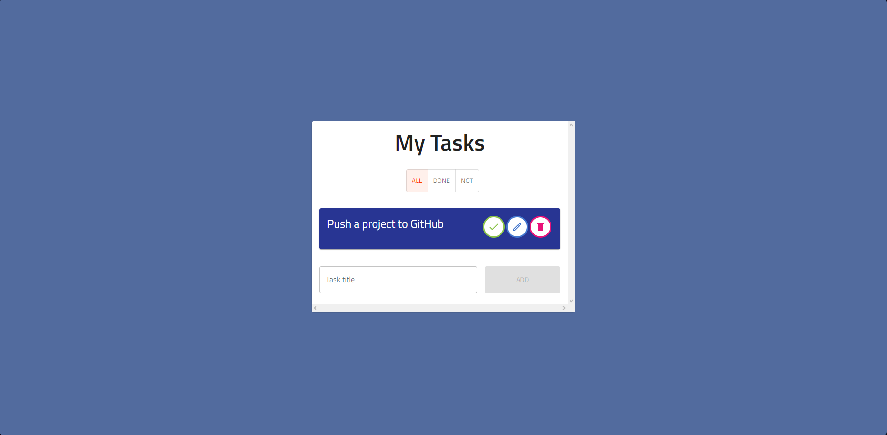
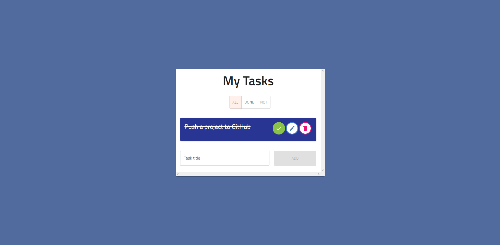
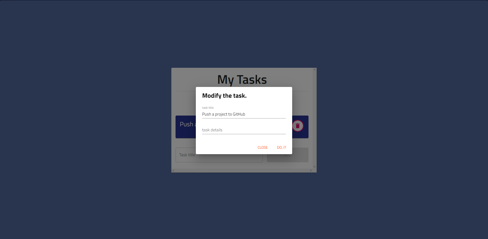
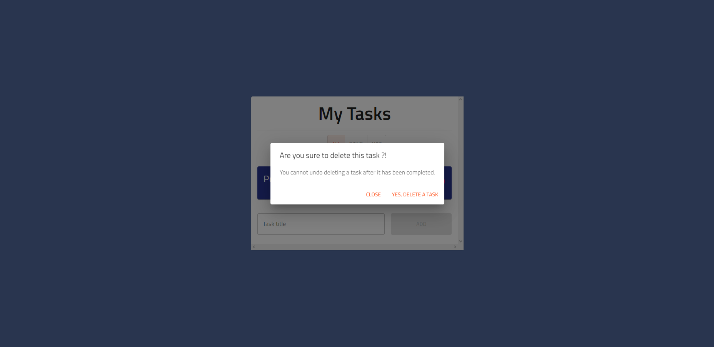

# Todo List Project use React.js

### The project is managing your task list, where you can add, delete, and modify any task. The site classifies tasks into several categories, including completed and uncompleted, and the data is stored in the browser's local storage.

### Tools & Libraries 
1. Material UI
2. Material Icon
3. google fonts
4. uuid library - id -
5. local storage 

-------

__(https://rad-bublanina-d5ce0f.netlify.app)__

---------

